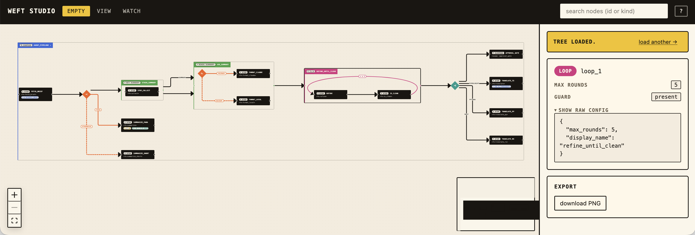

  

UI for [Fascicle](https://github.com/robmclarty/fascicle). A React Flow canvas that visualizes fascicle composition trees — every primitive, every wrapper, every labeled edge — with ELK layout and a live watch loop.

## Why weft exists

Fascicle programs *are* the tree. The composition is the source of truth — `step`, `compose`, `parallel`, `branch`, `cycle`, `use`, `stash`, `fallback`, `timeout`, `suspend`, `checkpoint`, `wrap` — wired together with edges that carry data, control, and policy. Reading that tree as JSON is fine for machines and miserable for humans. Reading it as code is better, until the tree gets big enough that the structure stops fitting in your head.

weft renders the tree so you can see it. Three commitments shape the project:

- **Faithful, never stylized.** Every primitive in the tree gets a renderer. Wrappers (retry, semaphore, timeout, cache) are visible badges. Edge labels reflect what fascicle actually emits — `THEN`, `OTHERWISE`, `PRIMARY`, `BACKUP`, `SUMMARY`, the cycle's bound. If a fascicle program does it, the canvas shows it.
- **Live by default.** Write a fascicle test, dump the tree to JSON, and the canvas re-renders within ~500 ms of every save. The hacking loop is `weft-watch <file>` plus a browser tab — the same tightness as a REPL, applied to composition.
- **Embeddable.** The canvas is a React component (`@robmclarty/weft`). Anything that can mount React can host a fascicle diagram — docs sites, internal tools, post-mortem timelines, runtime overlays of in-flight executions.

## The studio at a glance

The shot above shows the studio in `EMPTY` mode: header tabs (`EMPTY` / `VIEW` / `WATCH`), node search, the canvas rendering a fascicle FlowTree with steps, branches, a labeled `LOOP`, and a `parallel` fan-out, and the right-hand inspector populated with the selected loop's config (`max_rounds`, guard, raw JSON) plus a PNG export action. The whole interface is keyboard-driven — `?` opens the shortcuts modal, `/` jumps into search, arrow keys walk siblings on the canvas — so the studio behaves the same whether you're poking at a tree by hand or watching one stream in over the WebSocket.

## The pieces

| Package         | Workspace name | Published as            | Role                                                                  |
| --------------- | -------------- | ----------------------- | --------------------------------------------------------------------- |
| `packages/core` | `@repo/core`   | —                       | Schemas, transform, ELK layout, React Flow canvas, node renderers     |
| `packages/weft` | `@repo/weft`   | `@robmclarty/weft`      | Curated public surface — re-exports only                              |
| `packages/watch` | `@repo/watch` | `@robmclarty/weft-watch` | Node CLI: tails a JSON file, broadcasts changes over a localhost WS  |
| `packages/studio` | `@repo/studio` | — (unpublished SPA)   | Vite app with `/view?src=…` (URL fetch) and `/watch?ws=…` (live)      |

## Documentation

- [docs/getting-started.md](./docs/getting-started.md) — clone, install, see the canvas.
- [docs/architecture.md](./docs/architecture.md) — how a `FlowTree` becomes pixels.
- [docs/primitives.md](./docs/primitives.md) — visual catalogue of every primitive.
- [docs/studio.md](./docs/studio.md) — studio routes, loader, inspector, shortcuts.
- [docs/watch.md](./docs/watch.md) — the live-watch agent loop with `weft-watch`.
- [docs/embedding.md](./docs/embedding.md) — mounting `<WeftCanvas>` in your own app.
- [docs/layout.md](./docs/layout.md) — layout pipeline, metrics tooling, libavoid spike.
- [docs/visual-testing.md](./docs/visual-testing.md) — Playwright, screenshots, agent-browser.
- [docs/canvas-redesign-bc-deluxe.md](./docs/canvas-redesign-bc-deluxe.md) — topology decisions reference.

Working with an agent in this repo? Read [AGENTS.md](./AGENTS.md) (universal) and [CLAUDE.md](./CLAUDE.md) (Claude-specific).

## License

[Apache 2.0](./LICENSE).
