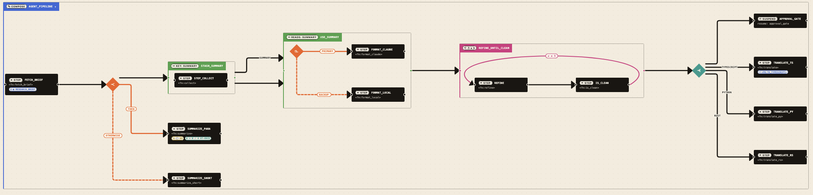

# Architecture

How a `FlowTree` becomes pixels — and why the pieces are split the way they are.



## The pipeline

Three layers, all pure where possible:

```text
FlowTree (validated JSON)
   │
   │  packages/core/src/transform/tree_to_graph.ts
   ▼
React Flow nodes + edges     (no positions yet, no waypoints)
   │
   │  packages/core/src/layout/layout_graph.ts
   ▼
Same nodes + edges, with positions and ELK-routed waypoints
   │
   │  packages/core/src/canvas/WeftCanvas.tsx
   ▼
React Flow renders, custom node + edge components paint
```

Every layer is independently testable. The transform is a pure function. The layout is async but deterministic given the same input. The canvas owns React state and the imperative ELK call.

### Layer 1 — `tree_to_graph`

Walks a validated `FlowTree` depth-first and emits a flat `{ nodes, edges }` pair shaped for React Flow. No positions yet (`{x:0, y:0}` placeholders). The transform encodes every topology decision:

- **Structural-only kinds** (`sequence`, `scope`) emit no node — children lift to peers and chain via structural edges. Scope additionally emits dashed `stash → use` overlay edges.
- **The container kind** is `compose`, which is the only kind that produces a visible outer box. Defaults to expanded; click toggles into `collapsed_composes` (passed through `TreeToGraphOptions`) and re-runs the transform.
- **Junctions** — `branch`, `fallback`, `parallel` emit a 56×56 diamond node; their children lift to peers; the junction emits role-tagged or port-keyed outgoing edges (`then` / `otherwise`, `primary` / `backup`, or per-key labels).
- **Wrappers as inline badges** — `pipe`, `timeout`, `checkpoint`, `map` emit no separate node. They walk their inner child and attach a `WrapperBadge { kind, label, position }` to the lifted child's `WeftNodeData.wrappers` array. The leaf renderer paints a corner pill.
- **Wrappers as edge geometry** — `retry` emits a self-loop arc on the wrapped child; `loop` emits a labeled container box hosting body, optional guard, and the back-arc.
- **Cycle sentinels** — the JSON form `{ kind: '<cycle>', id: '<target>' }` renders as a dedicated cycle node pointing back to its target.
- **`END` terminator** — appended unless the chain ends in a diverging junction (parallel / branch / fallback) where a single terminator would falsely imply convergence.

The full topology decisions (and the alternatives that were tried and abandoned) are documented in [canvas-redesign-bc-deluxe.md](./canvas-redesign-bc-deluxe.md).

The transform never mutates its input. Graph node ids are parent-prefixed (`<parent_path>/<node.id>`) so React Flow has globally unique ids; the local `id` survives in `WeftNodeData.id` for inspector lookups.

### Layer 2 — `layout_graph`

Builds an ELK graph from the React Flow nodes/edges and runs the layered algorithm in a Web Worker (`elkjs/lib/elk-worker.min.js` — keeps the page free of `unsafe-eval`). Defaults: `LR` direction, `node_spacing: 120`, `rank_spacing: 200`, ORTHOGONAL routing with `INCLUDE_CHILDREN`.

Two important wiring details:

1. **Edge waypoints flow back through to render.** ELK returns each routed edge with `sections: [{ startPoint, endPoint, bendPoints? }]`. `apply_edge_routes` walks the laid tree, accumulates ancestor offsets so the polyline lands in root (flow) coordinate space, and writes the result onto `WeftEdgeData.waypoints`. Without this, React Flow would re-route every edge from source/target handles using `smoothstep` and throw the bend points away (see [layout.md](./layout.md) for the full story).
2. **Layer-2 fallbacks.** A 10-second timeout cancels the ELK call and falls through to the deterministic `fallback_layout` (also fires when `Worker` is unavailable, e.g. server-side rendering). One console warning per process; the canvas keeps rendering.

The optional `libavoid-js` router (LGPL-2.1, behind `?router=libavoid` in the studio) is documented in [layout.md](./layout.md).

### Layer 3 — `WeftCanvas`

The React surface. Accepts a `tree` prop, runs `tree_to_graph` then `layout_graph` (debounced 200 ms, latest-wins), and hands the result to `<ReactFlow>` with two registries:

- `node_types` — kind → component dispatch table at [`packages/core/src/nodes/registry.ts`](../packages/core/src/nodes/registry.ts). One file per primitive; components do not import each other; unknown kinds fall through to `GenericNode`.
- `edge_types` — same idea at [`packages/core/src/edges/registry.ts`](../packages/core/src/edges/registry.ts). `weft-orth` (the default) renders ELK's polyline; `self-loop` and `loop-back` are synthetic arcs.

Auto-fit fires once per tree (or compose-toggle) on first mount; subsequent runtime-state overlays leave the user's pan/zoom alone. The `CanvasApi` returned through `on_ready` exposes `focus_node`, `fit_view`, `export_png`, `get_viewport` — see [embedding.md](./embedding.md).

## Runtime overlay

The structural graph renders the *shape* of the program. The runtime overlay renders the *execution*: which steps are active, which errored, which emitted recently, how much they cost.

```text
ParsedTrajectoryEvent[]   (validated against trajectory_event_schema)
        │
        │  derive_runtime_state(events, tree)
        ▼
ReadonlyMap<step_id, NodeRuntimeState>
        │
        │  WeftCanvas runtime_state prop
        ▼
RuntimeOverlay component renders pulse / scar / cost chip per node
```

`derive_runtime_state` is a pure projection, deterministic and order-sensitive. Cost rolls up the parent chain (a `step` inside a `compose` inside another `compose` charges all three). Re-deriving on every event tick is cheap — the canvas hot-path skips re-layout when only `runtime_state` changes.

Schema lives in [`packages/core/src/trajectory.ts`](../packages/core/src/trajectory.ts) — three well-known shapes (`span_start`, `span_end`, `emit`) plus a permissive `custom` fallback so any kind fascicle adds in the future round-trips without weft needing to release first.

## Persistence and collapse

Per-tree UI state (collapsed nodes, viewport, selected nodes) is keyed by `tree_id` (a structural hash of the FlowTree, see [`packages/core/src/tree_id.ts`](../packages/core/src/tree_id.ts)) and persisted to `localStorage` by the studio. Loading the same tree twice restores collapse and viewport; loading a different tree starts fresh.

Compose collapse is a separate, in-memory state inside `WeftCanvas` (toggled by clicking a compose). Container collapse (any kind with children, applied via `state/collapse.ts`) is a tree projection happening in the studio shell — useful when a user wants to hide the inside of a `branch` or `parallel` to focus on the outer flow.

## Package boundaries

| Package | Workspace name | Published as | Role |
|---|---|---|---|
| `packages/core` | `@repo/core` | — | Schemas, transform, ELK layout, React Flow canvas, node + edge renderers, runtime overlay |
| `packages/weft` | `@repo/weft` | `@robmclarty/weft` | Curated public surface — re-exports from `@repo/core` only, no logic |
| `packages/watch` | `@repo/watch` | `@robmclarty/weft-watch` | Node CLI: tails JSON, broadcasts changes over a localhost WebSocket |
| `packages/studio` | `@repo/studio` | — (unpublished SPA) | Vite app: `/view?src=…`, `/watch?ws=…`, `/` empty state, loader / inspector / search |

The split is deliberate:

- **Core has no studio dependency.** A host app can `import { WeftCanvas } from '@robmclarty/weft'` and never pull a Vite SPA, a router, or a loader panel. See [embedding.md](./embedding.md).
- **Watch has no React dependency.** The CLI ships pure Node (chokidar + ws + zod) so a CI environment can stream trees without a browser.
- **The umbrella (`@repo/weft`) is re-exports only.** New API surface is added by exporting from `core/src/index.ts` and re-exporting from `weft/src/index.ts`. The umbrella enforces "did you mean to make this public?" at the import site.

`@repo/core` has one optional dependency: `libavoid-js` for the routing spike. It loads lazily, so consumers who don't pass `router: 'libavoid'` never hit the WASM blob.

## What weft is not

- It is not a graph editor. Nodes are positioned by ELK, not by the user. (You can pan/zoom; you cannot drag a node.)
- It is not a fascicle runtime. weft visualizes trees fascicle dumps; it doesn't execute them.
- It is not opinionated about transport. `weft-watch` is one option (file → WebSocket); embedding the canvas with your own data flow is another (see [embedding.md](./embedding.md)); fetching a URL with `/view?src=` is a third.
