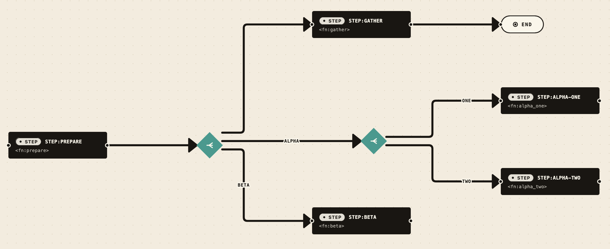
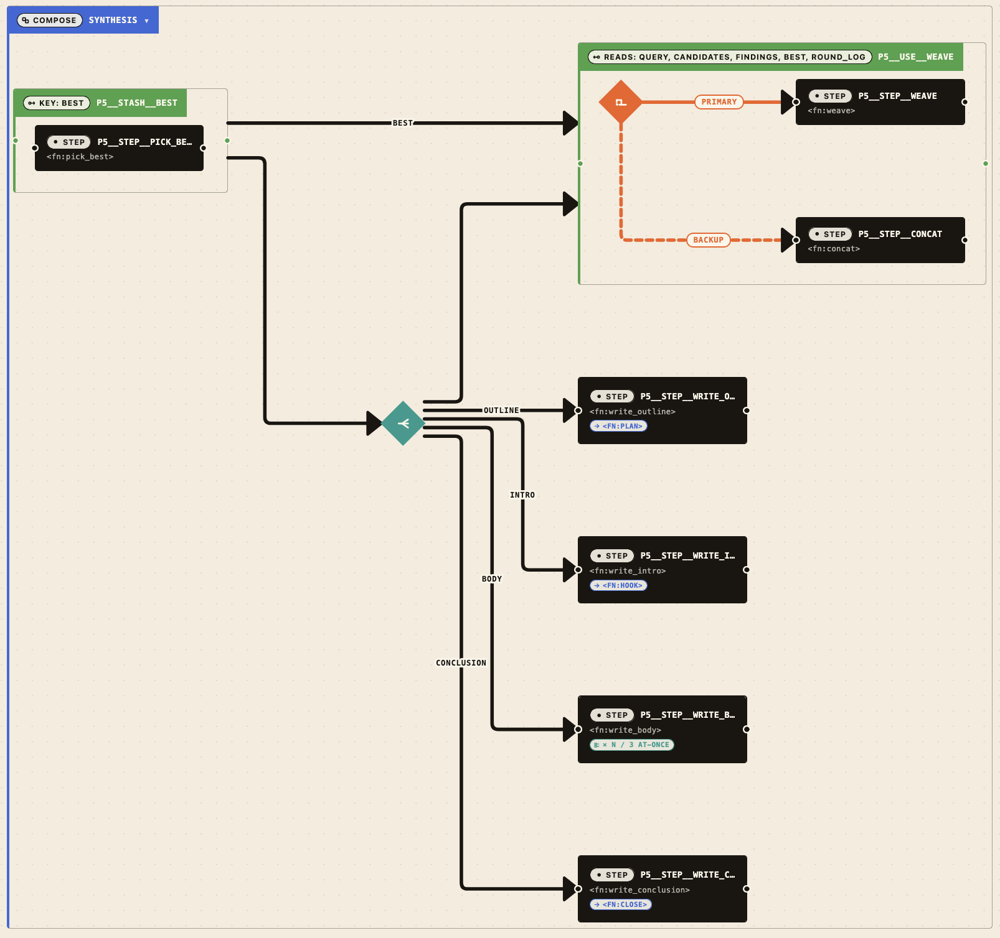

# Primitives

Every primitive a fascicle program emits gets its own renderer. The renderers are deliberately faithful — what fascicle says, weft draws — and they read together as a subway map: thick orthogonal lines, family-colored stations, role-tagged transfers.

This doc walks the catalogue. For the topology decisions behind the rendering (why wrappers became corner badges, why branch became a diamond), see [canvas-redesign-bc-deluxe.md](./canvas-redesign-bc-deluxe.md). For the transform that produces these shapes, see [`packages/core/src/transform/tree_to_graph.ts`](../packages/core/src/transform/tree_to_graph.ts) and the renderers under [`packages/core/src/nodes/`](../packages/core/src/nodes/).

## How to read the canvas



The fixture above (`fixtures/all_primitives.json`, simplified view) shows the four reading rules:

1. **Black blocks are work** — every `step` is a black pill labelled with its id and its `<fn:name>`. The eye follows arrows between black blocks.
2. **Coloured stations are control** — diamonds, containers, pills with non-black fills are decisions, parallel splits, scopes, composites. Each kind has a stable family color.
3. **Edge style carries semantics** — solid black is a structural chain; solid orange means happy-path divergence (`then` / `primary`); dashed orange means alternate (`otherwise` / `backup`); the magenta / yellow arcs are loop / retry geometry.
4. **The terminator pill** — every workflow that terminates linearly ends with a single `END` pill. Diverging tails (parallel / branch / fallback) deliberately don't get one.

## Leaves

### `step`

The atom of fascicle. Black pill, ~220×60 px, labeled with the step id and the function reference (`<fn:name>`). Inline corner badges appear when the step is wrapped by `pipe`, `timeout`, `checkpoint`, or `map` — see Wrappers below.

### `suspend`

Resume gate. Pill with a teal `‖ SUSPEND` badge. Carries `resume: <gate_id>` in its label. The runtime pauses here until an external resume call.

### `stash` and `use`

Scope's bookkeeping. `stash` pushes a value into a named slot under a `key`; `use` reads one or more keys downstream. Visually they're green pills (`KEY: <name>` for stash, `READS: <keys>` for use). When wrapping a child they upgrade to labelled containers.

A `scope` doesn't render itself; it lifts its children to peers, chains them, and emits dashed orange `stash → use` overlay edges that ride alongside the structural chain. The overlay says "this `use` reads from that `stash`" without disrupting the temporal flow.

### `cycle`

The JSON sentinel `{ kind: '<cycle>', id: '<target>' }`. Renders as a gray pill labelled `↺ → <target_id>`. Used when a tree diff would otherwise infinite-loop; weft preserves the structure but caps the recursion.

### `end`

A single white pill marking the terminal of a linear workflow. Emitted automatically by the transform unless the chain ends in a diverging junction.

## Junctions

### `branch(when, then, otherwise)`

Orange diamond, 56×56. Two outgoing edges with role-tagged labels:

- `then` — solid orange, exits EAST.
- `otherwise` — dashed orange, exits SOUTH.

The role split is visual, not logical: both children execute one or the other based on `when`, but the eye reads "main path" vs "alternate path" at a glance. Children lift to peers, so a `branch` of two `step`s shows as `diamond → step` / `diamond → step` (no nested chrome).

### `fallback(primary, backup)`

Orange diamond, identical chrome to `branch`. Outgoing edges are labelled `primary` (solid) and `backup` (dashed). Same visual language: try the solid path; fall through to the dashed one.

### `parallel(keys, ...children)`

Teal diamond. One outgoing edge per child, labelled with the corresponding `keys[i]`, exiting EAST in declaration order (ELK `FIXED_ORDER` + per-port `FIXED_POS`). N can be any positive integer; the diamond stays 56×56 and the edges fan out down the right side.

The parallel diamond is the only junction that preserves N edges out of one node — that's the whole point. Branch and fallback always have exactly two.

## The compose container



`compose` is the **only** primitive that draws a visible outer box. Other "container" kinds (`sequence`, `scope`) lift their children to peers and disappear; junction kinds collapse to diamonds. Compose stays a box because it represents a named subprogram — a unit you might want to reuse, collapse, or drill into.

Default behaviour is **expanded**: the inner subgraph renders inside the box on first load. Click the compose chrome to toggle to a single labelled block (`▸ COMPOSE: name`); click again to re-expand (`▾`). External edges always anchor on the box perimeter, never thread through the inside, so the boundary is sharp.

Multiple `compose`s can nest. Each toggles independently.

## Wrappers as inline badges

Four wrapper kinds — `pipe`, `timeout`, `checkpoint`, `map` — emit no separate node. They walk their inner child and attach a corner badge to the lifted child's renderer. The badge sits on the leaf:

| Kind | Position | Badge label format | Role |
|---|---|---|---|
| `pipe(child, fn)` | after | `<fn:to_typescript>` | transforms the step's output |
| `timeout(child, ms)` | after | `⏱ 30s` (or `⏱ 800ms`) | caps the step's duration |
| `checkpoint(child, key)` | before | `■ <key>` | loads cached input from key |
| `map(child, n?)` | before | `× n / 4 at-once` | fans the step out per item |

`before` badges sit on the chain's entry point (the step the chain edge lands on); `after` badges sit on the chain's exit. A single step can carry multiple badges — `checkpoint(pipe(step, fn))` paints both, `■ key` on the inbound side and `<fn:name>` on the outbound.

Two wrapper kinds keep their original geometric form because the geometry IS the visual:

### `retry(child)`

The wrapper drops entirely; the wrapped child gains a yellow self-loop arc above it labelled `↻ 3× / 250ms`. The arc anchors on the right-out handle and returns to the same point — a literal "go around again" gesture. See [`SelfLoopEdge.tsx`](../packages/core/src/edges/SelfLoopEdge.tsx).

### `loop(body, guard?)`

A magenta labelled container holding body, optional guard, and the back-arc:

- **Without guard:** the body has a back-arc going right-out → left-in on the same node, labelled `↺ ≤ N`.
- **With guard:** the chain runs body → guard inside the box, and the back-arc sweeps from guard's right-out to body's left-in.

External edges anchor on the container so the exit reads as one labelled arrow leaving the loop. See [`LoopBackEdge.tsx`](../packages/core/src/edges/LoopBackEdge.tsx).

## Edges

| Kind | Component | Visual | When |
|---|---|---|---|
| `structural` | `WeftOrthogonalEdge` | solid black orthogonal polyline with rounded corners | sequence chain, junction fan-out, compose membership |
| `overlay` | `WeftOrthogonalEdge` | dashed orange | `stash → use` inside a `scope` |
| `self-loop` | `SelfLoopEdge` | yellow arc above the node | `retry` |
| `loop-back` | `LoopBackEdge` | magenta sweeping arc | `loop` body / guard back-edge |

The orthogonal polyline is ELK's actual computed route — `apply_edge_routes` in [`elk_runner.ts`](../packages/core/src/layout/elk_runner.ts) harvests the `sections.bendPoints` and writes them onto the edge so React Flow renders what ELK actually decided, not a `smoothstep` re-routing. See [layout.md](./layout.md) for the full story.

Edge labels render with a paper-colored text-stroke halo, anchored at the longest segment's midpoint so chips land on open canvas instead of pinned to elbows.

## Generic and unknown kinds

Anything not on the catalogue list above renders through `GenericNode` — a labelled gray pill with the kind name and the raw config dump in the inspector. This is the "fascicle adds a primitive, weft hasn't released yet" path. The transform still recurses into `children` so unknown wrappers don't hide their contents.

## See it for yourself

Boot the studio and load a fixture:

```bash
pnpm --filter @repo/studio dev
# http://127.0.0.1:5173/view?src=http://127.0.0.1:5173/fixtures/all_primitives.json   — every primitive
# http://127.0.0.1:5173/view?src=http://127.0.0.1:5173/fixtures/the_loom.json          — kitchen-sink composition
# http://127.0.0.1:5173/view?src=http://127.0.0.1:5173/fixtures/parallel_ordering.json — FIXED_ORDER demo
# http://127.0.0.1:5173/view?src=http://127.0.0.1:5173/fixtures/nested_parallel.json   — junctions inside junctions
```

Click any node for the inspector view. See [studio.md](./studio.md) for the rest of the chrome.
