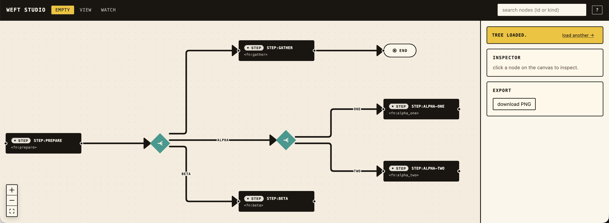

# weft studio

The studio is the reference UI for `@robmclarty/weft` — a Vite SPA that hosts the canvas plus a loader, an inspector, and the live-watch glue. It lives at `packages/studio/` and is intentionally unpublished: it's a kitchen-sink demo and the development harness, not a product.



## Boot

```bash
pnpm --filter @repo/studio dev
```

Opens on `http://127.0.0.1:5173`. Three routes:

| Route | URL form | Purpose |
|---|---|---|
| `/` | `/` | empty state — drag-drop / paste / URL prompt via the loader panel |
| `/view` | `/view?src=<url>` | fetch a JSON `FlowTree` from the URL and render it |
| `/watch` | `/watch?ws=<port>` | subscribe to a [`weft-watch`](./watch.md) WebSocket on `127.0.0.1:<port>` |

Every fixture under `fixtures/` is served by the dev server at `/fixtures/<name>.json`. So:

```text
http://127.0.0.1:5173/view?src=http://127.0.0.1:5173/fixtures/all_primitives.json
http://127.0.0.1:5173/view?src=http://127.0.0.1:5173/fixtures/the_loom.json
```

`/view` only fetches `https:` and `http://localhost`/`http://127.0.0.1` URLs (per spec — prevents a hostile link from pointing at an arbitrary origin). The fetch uses `credentials: 'omit'` and `redirect: 'error'`. Validation failures never replace the previous canvas; the loader panel surfaces the JSON path of the offending field.

## Header chrome

- **Nav** — `empty`, `view`, `watch`. Active route is highlighted.
- **Search box** — type a substring; nodes whose `id` or `kind` matches gain a `weft-search-match` highlight class. Match count appears in the chip beside the input. Press `/` to focus from anywhere.
- **`?`** — opens the keyboard-shortcut modal (also bound to `?`).

## Side panel

Three sections, top to bottom:

### Loader

Drag-drop a `.json` file, paste raw JSON, or fetch a URL. All three input modes flow through the same validate-then-replace pipeline (`flow_tree_schema`); validation failure is surfaced inline without replacing the current canvas. Once a tree is loaded the panel collapses to a compact "load another →" link to free sidebar space.

A bare `FlowNode` is auto-wrapped into a `{ version: 1, root: <node> }` tree so you can paste an unwrapped fascicle dump.

### Inspector


Empty until you click a node. Then renders a kind-aware view:

- A colored kind pill and the local node id.
- The node's `meta.description` if present.
- A kind-specific section: function ref for `step`, key for `stash`, `keys` array for `use`, `concurrency` for `map`, `max_rounds` and guard for `loop`, etc.
- A `<details>`-folded "show raw config" disclosure so the original JSON is always one click away.

Click empty canvas (or press `Esc`) to clear the selection.

### Export

`download PNG` snaps the current canvas to a PNG (via `html-to-image`) and triggers a browser download. The same code path is exposed programmatically via `CanvasApi.export_png()` — see [embedding.md](./embedding.md).

## Canvas chrome

- **Top-right banners** — connection status (watch route), validation errors, fetch state.
- **Bottom-left controls** — React Flow zoom in / out / reset.
- **Bottom-right minimap** — appears once the graph has ≥12 nodes (below that it's just visual clutter on a graph that already fits).
- **Auto-fit** — the canvas fits the graph once on first mount and once per compose toggle. Subsequent runtime-state overlays (when watching) leave the user's pan/zoom alone.

## Persistence

Per-tree state — collapsed nodes, viewport, last-selected node — is keyed by a structural hash of the FlowTree (`tree_id`) and stored in `localStorage` (LRU, ~32 entries). Loading the same tree twice restores collapse and viewport; loading a different tree starts fresh.

## Keyboard shortcuts

| Key | Action |
|---|---|
| `f` | fit view |
| `/` | focus the search box |
| `Esc` | clear selection / close help dialog |
| `?` | toggle the help dialog |

The shortcuts modal is the source of truth — open it with `?` to confirm.

## Interaction details

- **Single-click a `compose`** — toggle expand / collapse. The same gesture also selects the compose for the inspector; one click does both.
- **Double-click any container with children** — toggle a more aggressive collapse via the `state/collapse.ts` projection (hides the inside of branches, parallels, scopes too). Useful for focus.
- **Single-click any other node** — select for the inspector, no canvas change.
- **Drag the canvas pane** — pan. (Nodes are not draggable; positions come from ELK.)
- **Wheel** — zoom. `cmd`/`ctrl` + wheel zooms tighter.

## Routing flag — `?router=libavoid`

Append `&router=libavoid` to a `/view?src=…` URL to re-route edges with the `libavoid-js` spike instead of ELK. Requires `packages/studio/public/libavoid.wasm` to exist (see [layout.md](./layout.md) for the copy command). Falls back silently to ELK if the WASM isn't there. Diagnostic only — ELK is the shipped default.

## Source

- App shell: [`packages/studio/src/App.tsx`](../packages/studio/src/App.tsx)
- Routes: [`packages/studio/src/routes/`](../packages/studio/src/routes/)
- Components: [`packages/studio/src/components/`](../packages/studio/src/components/)
- Watch socket: [`packages/studio/src/state/use_watch_socket.ts`](../packages/studio/src/state/use_watch_socket.ts)
